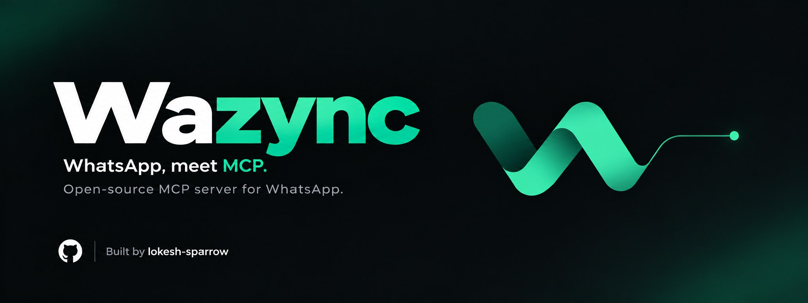

<p align="center">
  
</p>

# Wazync

Save documents shared in WhatsApp groups into your own folders, by asking Claude.

Ask *"get today's ACME documents to D:\Clients\ACME\October"* and Claude checks the
connection, finds the group, saves every new file into that folder, names each one
from what the document says, and shows you a table of what was saved where.

Wazync reads and saves. It cannot send messages, files or anything else from your
number: there is no sending code in it.

## Install

You need Windows, [Claude Desktop](https://claude.ai/download) and your phone with
WhatsApp.

1. Download `wazync-1.0.1.mcpb` from the
   [latest release](https://github.com/lokesh-sparrow/wazync/releases/latest).
2. Drag it into Claude Desktop (or double-click it) and choose **Install**.
3. In a new chat, ask **"link my WhatsApp"**. A QR code appears in the chat. On
   your phone open WhatsApp → Settings → Linked devices → Link a device, and scan
   it. Your recent chats load within a few minutes.

That's all. Nothing else to install.

## Using it

Ask in plain words, for example:

> Get yesterday's and today's documents from the Accounts group to D:\Clients\ACME\October

> Which files did the ACME group share this week?

> Save the invoice John sent today to D:\Clients\ACME\Invoices

Wazync saves only into the folder you name, never overwrites a file, and never
saves the same file to the same folder twice.

### File names

Each saved file gets a short name taken from the document itself:
`<issuer>-<date>-<party>`, for example `ADCB-06.10.26-John Smith.pdf`. The date is
the document's own date, legal suffixes such as LLC are dropped, amounts are left
out, and a second file with the same issuer, date and party becomes `-1`, `-2` and
so on. Names stay well within Windows' 260-character path limit.

### Tools

| Tool | What it does |
| --- | --- |
| get_status | Checks that WhatsApp is linked, connected and receiving messages |
| link_whatsapp | Shows the QR code to link your WhatsApp |
| list_chats | Finds chats and groups by name |
| list_messages | Reads messages, filtered by chat, sender, text or date |
| get_message_context | Shows the messages around one message |
| search_contacts | Finds people by name or number |
| list_media | Lists the files shared in a chat, with name, sender and whether each one was already saved |
| save_media | Saves a file into a folder and gives Claude its content for naming |
| rename_saved_file | Renames a file that Wazync saved, never overwriting |

## How it works

The extension carries a small background program, the bridge. The bridge links to
your WhatsApp as a linked device, the same way WhatsApp Web does, and keeps a local
record of your chats as messages arrive.

- The extension starts the bridge in the background whenever Claude Desktop needs it.
- With **Start with Windows** on (the default), the bridge also starts when you sign
  in, so messages keep arriving while Claude Desktop is closed. Turn it off in
  Settings → Extensions → Wazync.
- Your WhatsApp link, the message record and the list of saved files are kept in
  `%LOCALAPPDATA%\Wazync`.
- The bridge only accepts connections from your own computer (127.0.0.1), and only
  from the Wazync extension: each time it starts it creates a new secret key that
  only your Windows account can read, and it refuses every request without that key.
  Other people signed in to the same computer cannot read your messages through it.

## Privacy and safety

- **No sending.** Wazync has no code that sends messages, files, reactions or read
  receipts.
- **Stored on your computer.** Messages are kept readable in `%LOCALAPPDATA%\Wazync`,
  like WhatsApp Desktop's own data, protected by Windows so only your account (and
  the computer's administrators) can open it. Turn on BitLocker for full-disk
  encryption.
- **Local only.** Wazync itself sends nothing anywhere except its connection to
  WhatsApp. What Claude reads through the tools becomes part of your Claude
  conversation, like anything else you share with Claude. Other computers on your
  network cannot reach the bridge, and other users of the same computer are refused
  without the secret key.
- **Quiet logs.** The bridge log records connection events and that a file arrived,
  not message text.
- **Messages are data.** Claude is told to treat message text, captions and file
  names as content from other people, never as instructions.
- **Your folders only.** Files are saved only into the folder named in your request,
  and Wazync renames only files it saved itself.

## Good to know

- WhatsApp removes old files from its servers after a while, so files from months
  ago may no longer download. Asking daily or weekly keeps up with new files.
- If you remove the linked device from your phone, ask "link my WhatsApp" again.
- **Uninstall:** remove Wazync in Claude Desktop → Settings → Extensions. The
  bridge stops at your next sign-in and removes its own start entry. To remove your
  data as well, delete the `%LOCALAPPDATA%\Wazync` folder.

## Build from source

With [Go](https://go.dev/dl/) 1.26 or newer installed, run in PowerShell:

```powershell
git clone https://github.com/lokesh-sparrow/wazync.git
cd wazync
.\build.ps1
```

This creates `dist\wazync-1.0.1.mcpb`, ready to install as above.

## Credits

Wazync builds on [whatsapp-mcp](https://github.com/lharries/whatsapp-mcp) by Luke
Harries (MIT) and uses [whatsmeow](https://github.com/tulir/whatsmeow) (MPL-2.0) for
the WhatsApp connection, [modernc.org/sqlite](https://gitlab.com/cznic/sqlite)
(BSD-3-Clause) for the local record and [ledongthuc/pdf](https://github.com/ledongthuc/pdf)
(BSD-3-Clause) to read PDF text.

## Disclaimer

Wazync is an independent project. It is not affiliated with, endorsed by or
supported by WhatsApp or Meta. It uses WhatsApp's linked-device protocol through an
unofficial library, which WhatsApp's terms may not allow; you use it at your own
risk.

## License

MIT. See [LICENSE](LICENSE).
